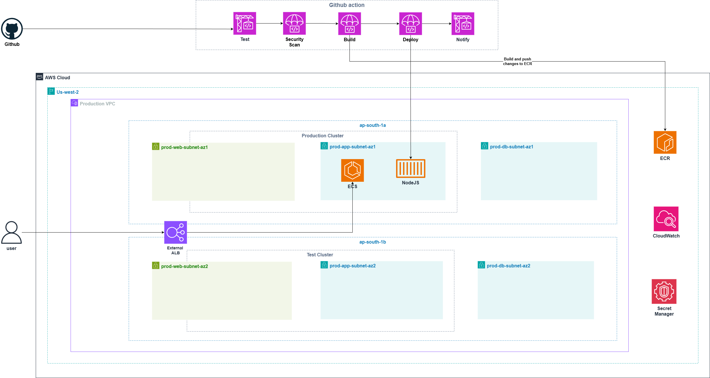
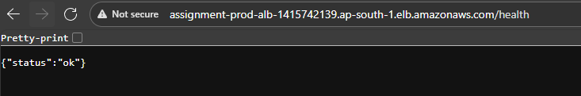
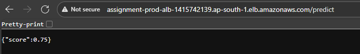
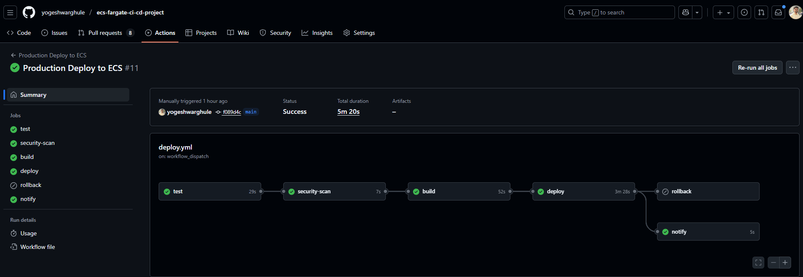
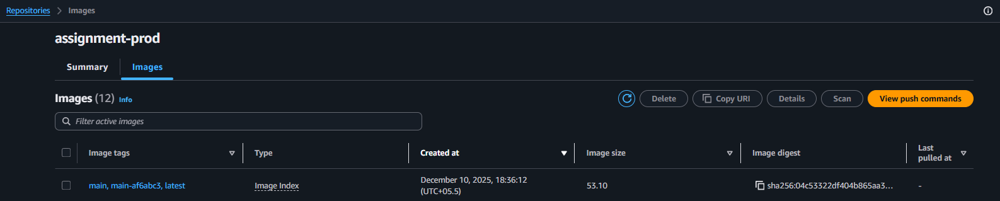
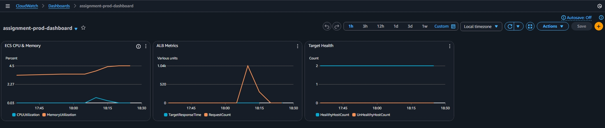
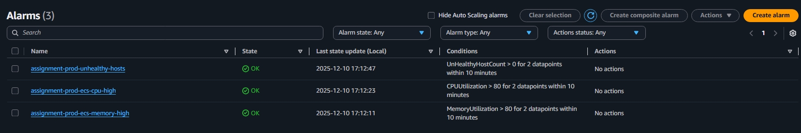
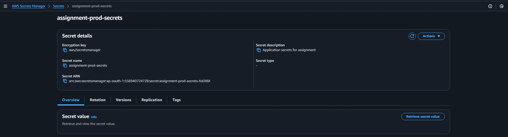

# Healthcare API on AWS ECS Fargate

A production-ready containerized API deployed on AWS using modern DevOps practices. Built for a healthcare technology assignment demonstrating cloud automation, monitoring, and security best practices.

## What This Project Does

This is a simple Node.js API with two endpoints that showcases enterprise-grade deployment on AWS:

**Live Endpoints (Try them!):**
- **Health Check**: http://assignment-prod-alb-1415742139.ap-south-1.elb.amazonaws.com/health
- **Prediction API**: http://assignment-prod-alb-1415742139.ap-south-1.elb.amazonaws.com/predict

## Table of Contents

- [Architecture Overview](#architecture-overview)
- [API Endpoints](#api-endpoints)
- [CI/CD Pipeline](#cicd-pipeline)
- [Deployment Guide](#deployment-guide)
- [Monitoring & Alerts](#monitoring--alerts)
- [Security Design](#security-design)
- [Cost Optimization](#cost-optimization)
- [Future Improvements](#future-improvements)
- [Project Structure](#project-structure)

## Architecture Overview



Our infrastructure follows AWS Well-Architected principles:

### Core Components:
- **VPC**: Multi-AZ setup with public/private subnets
- **ECS Fargate**: Serverless container orchestration
- **Application Load Balancer**: HTTP load balancing with health checks
- **ECR**: Private container registry
- **CloudWatch**: Comprehensive monitoring and alerting
- **IAM**: Least-privilege security model
- **Secrets Manager**: Secure credential storage

### Network Design:
```
Internet → ALB (Public Subnets) → ECS Tasks (Private Subnets)
                                      ↓
                              VPC Endpoints (No NAT Gateway!)
```

**Why this architecture?**
- **Cost-effective**: VPC endpoints eliminate NAT Gateway costs (~$45/month saved)
- **Secure**: ECS tasks run in private subnets with no internet access
- **Scalable**: Auto-scaling based on CPU/memory metrics
- **Resilient**: Multi-AZ deployment for high availability

## API Endpoints

### GET /health
Returns application health status.

**Response:**
```json
{
  "status": "ok"
}
```



### GET /predict
Returns a mock prediction score for healthcare analytics.

**Response:**
```json
{
  "score": 0.75
}
```



## CI/CD Pipeline

Our GitHub Actions pipeline ensures quality and security at every step:



### Pipeline Stages:

#### 1. **Test Stage**
- Node.js unit tests with Jest
- Security audit with `npm audit`
- Dockerfile linting with Hadolint
- Code quality checks with ESLint

#### 2. **Security Scan**
- Trivy vulnerability scanning
- Container image security analysis
- Dependency vulnerability checks

#### 3. **Build Stage**
- Multi-stage Docker build
- Image optimization and caching
- Push to Amazon ECR with proper tagging

#### 4. **Deploy Stage**
- ECS service update with rolling deployment
- Health check validation
- Automatic rollback on failure

#### 5. **Notification**
- Slack notifications for deployment status
- Success/failure/rollback alerts

### Deployment Triggers:
- **Automatic**: Push to `main` branch (application changes)
- **Manual**: GitHub Actions workflow dispatch

## Deployment Guide

### Prerequisites
- AWS CLI configured with profile `terraform-mcp`
- Terraform >= 1.0
- Docker (for local builds)

### First-Time Deployment

#### Step 1: Deploy Infrastructure
```bash
cd terraform/environments/prod
terraform init
terraform plan
terraform apply
```

**What gets created?** 35 AWS resources including VPC, ECS cluster, ALB, and monitoring.

#### Step 2: Deploy Application

**Option A: GitHub Actions (Recommended)**
1. Add GitHub secrets: `AWS_ACCESS_KEY_ID`, `AWS_SECRET_ACCESS_KEY`
2. Push changes or manually trigger workflow

**Option B: Manual Docker Push**
```bash
# Login to ECR
aws ecr get-login-password --region ap-south-1 --profile terraform-mcp | \
  docker login --username AWS --password-stdin <account-id>.dkr.ecr.ap-south-1.amazonaws.com

# Build and push
cd application
docker build -t assignment-prod:latest .
docker tag assignment-prod:latest <ecr-url>:latest
docker push <ecr-url>:latest

# Deploy to ECS
aws ecs update-service --cluster assignment-prod-cluster \
  --service assignment-prod-service --force-new-deployment
```

### Verify Deployment
```bash
# Check service status
aws ecs describe-services --cluster assignment-prod-cluster \
  --services assignment-prod-service --query "services[0].[runningCount,desiredCount]"

# Test endpoints
curl http://$(terraform output -raw alb_dns_name)/health
curl http://$(terraform output -raw alb_dns_name)/predict
```

### Daily Cleanup (Cost Saving)
```bash
terraform destroy  # Saves ~$3.24/day
```



## Monitoring & Alerts

We've implemented comprehensive monitoring to ensure application health and performance.

### CloudWatch Dashboard


**Metrics tracked:**
- ECS CPU and Memory utilization
- ALB request count and response time
- Target group health status
- Application logs and errors

### Alert Configuration


**Three critical alerts:**

#### High CPU Alert
- **Trigger**: CPU > 80% for 10 minutes
- **Action**: SNS notification (if email configured)
- **Purpose**: Detect performance issues

#### High Memory Alert  
- **Trigger**: Memory > 80% for 10 minutes
- **Action**: SNS notification
- **Purpose**: Prevent out-of-memory crashes

#### Health Check Alert
- **Trigger**: Unhealthy targets > 0
- **Action**: Immediate SNS notification
- **Purpose**: Detect application failures

### Log Management
- **Centralized logging** via CloudWatch Logs
- **7-day retention** to control costs
- **Structured logging** for easy debugging

## Security Design

Security is built into every layer of our architecture.



### Network Security
- **Private subnets**: ECS tasks have no direct internet access
- **Security groups**: Least-privilege network rules
- **VPC endpoints**: Secure AWS service communication

### Application Security
- **Non-root container**: Docker runs as `appuser` (UID 1001)
- **Multi-stage build**: Minimal attack surface
- **Health checks**: Built-in container monitoring

### Secrets Management
- **AWS Secrets Manager**: Encrypted credential storage
- **IAM roles**: No hardcoded credentials
- **Environment injection**: Secrets loaded at runtime

### Access Control
```json
{
  "ECS Task Execution Role": [
    "ecr:GetAuthorizationToken",
    "ecr:BatchGetImage",
    "secretsmanager:GetSecretValue"
  ],
  "ECS Task Role": [
    "secretsmanager:GetSecretValue"
  ]
}
```

### Security Scanning
- **Container scanning**: Trivy in CI/CD pipeline
- **Dependency audit**: npm audit for vulnerabilities
- **ECR scanning**: Automatic image vulnerability detection

## Cost Optimization

Smart cost management without compromising functionality.

### Daily Destroy Strategy
**Morning**: `terraform apply` (5 minutes)
**Evening**: `terraform destroy` (3 minutes)

**Monthly savings**: ~$97 (from $100 to $3)

### What Persists (Free):
- ECR repository and images (500MB free tier)
- Terraform state files
- GitHub repository and actions

### What Gets Recreated:
- VPC and networking (free)
- ECS cluster and services (~$0.08/hour)
- Application Load Balancer (~$0.025/hour)
- VPC endpoints (~$0.03/hour)

### Cost Breakdown:
```
Running 24/7: ~$100/month
Daily destroy: ~$3/month (work hours only)
Savings: 97% cost reduction!
```

## Future Improvements

Here's how we can enhance this solution for production scale:

### Enhanced Security
- **HTTPS/TLS**: Add SSL certificate and redirect HTTP to HTTPS
- **WAF**: Web Application Firewall for DDoS protection
- **VPN/PrivateLink**: Secure admin access
- **Secrets rotation**: Automatic credential rotation
- **Container signing**: Sign images with AWS Signer

### Scalability & Performance
- **Auto Scaling**: CPU/memory-based scaling policies
- **Multi-region**: Deploy across multiple AWS regions
- **CDN**: CloudFront for static content caching
- **Database**: Add RDS for persistent data storage
- **Redis**: Caching layer for improved performance

### Advanced Monitoring
- **Distributed tracing**: AWS X-Ray for request tracking
- **Custom metrics**: Business-specific monitoring
- **Log aggregation**: ELK stack or AWS OpenSearch
- **Synthetic monitoring**: Automated endpoint testing
- **Performance insights**: Application performance monitoring

### DevOps Enhancements
- **GitOps**: ArgoCD or Flux for deployment automation
- **Feature flags**: LaunchDarkly or AWS AppConfig
- **Blue/Green deployments**: Zero-downtime deployments
- **Canary releases**: Gradual rollout strategy
- **Infrastructure testing**: Terratest for IaC validation

### Enterprise Features
- **Service mesh**: Istio or AWS App Mesh
- **API Gateway**: Rate limiting and authentication
- **Backup strategy**: Automated backup and recovery
- **Compliance**: SOC2, HIPAA compliance features
- **Multi-tenancy**: Support for multiple customers

### AI/ML Integration
- **Model serving**: SageMaker endpoints
- **Data pipeline**: Step Functions for ML workflows
- **A/B testing**: Experiment management
- **Real-time inference**: Kinesis for streaming data
- **Model monitoring**: Drift detection and retraining

## Project Structure

```
amazon-q/
├── application/              # Node.js API
│   ├── Dockerfile              # Multi-stage production build
│   ├── index.js                # Express server with /health & /predict
│   ├── index.test.js           # Jest unit tests
│   └── package.json            # Dependencies and scripts
├── terraform/               # Infrastructure as Code
│   ├── modules/                # Reusable Terraform modules
│   │   ├── vpc/               # Network infrastructure
│   │   ├── ecr/               # Container registry
│   │   ├── iam/               # Security roles and policies
│   │   ├── alb/               # Load balancer
│   │   ├── ecs/               # Container orchestration
│   │   └── cloudwatch/        # Monitoring and alerts
│   └── environments/
│       └── prod/              # Production environment config
├── .github/workflows/       # CI/CD pipeline
│   └── deploy.yml             # GitHub Actions workflow
├── images/                  # Screenshots and diagrams
└── Documentation files
```

## Technology Stack

- **Runtime**: Node.js 18 (Alpine Linux)
- **Framework**: Express.js
- **Testing**: Jest + Supertest
- **Containerization**: Docker (multi-stage)
- **Orchestration**: AWS ECS Fargate
- **Infrastructure**: Terraform
- **CI/CD**: GitHub Actions
- **Monitoring**: CloudWatch
- **Security**: AWS IAM + Secrets Manager

## Support & Troubleshooting

### Common Issues:

**ECS tasks not starting?**
```bash
aws logs tail /ecs/assignment-prod --follow
```

**Health checks failing?**
```bash
aws elbv2 describe-target-health --target-group-arn <arn>
```

**Terraform destroy stuck?**
```bash
aws ecs delete-service --cluster assignment-prod-cluster --service assignment-prod-service --force
```

### Quick Commands:
```bash
# Get ALB URL
terraform output alb_dns_name

# Check service status  
aws ecs describe-services --cluster assignment-prod-cluster --services assignment-prod-service

# View logs
aws logs tail /ecs/assignment-prod --follow
```

---

## Conclusion

This project demonstrates enterprise-grade DevOps practices in a healthcare technology context. From automated testing to secure deployment, every aspect follows industry best practices.

**Key achievements:**
- Production-ready containerized application
- Fully automated CI/CD pipeline
- Comprehensive monitoring and alerting
- Security-first architecture design
- Cost-optimized infrastructure
- Detailed documentation and troubleshooting

Ready to scale for real-world healthcare applications!

---

*Built with love for healthcare technology innovation*